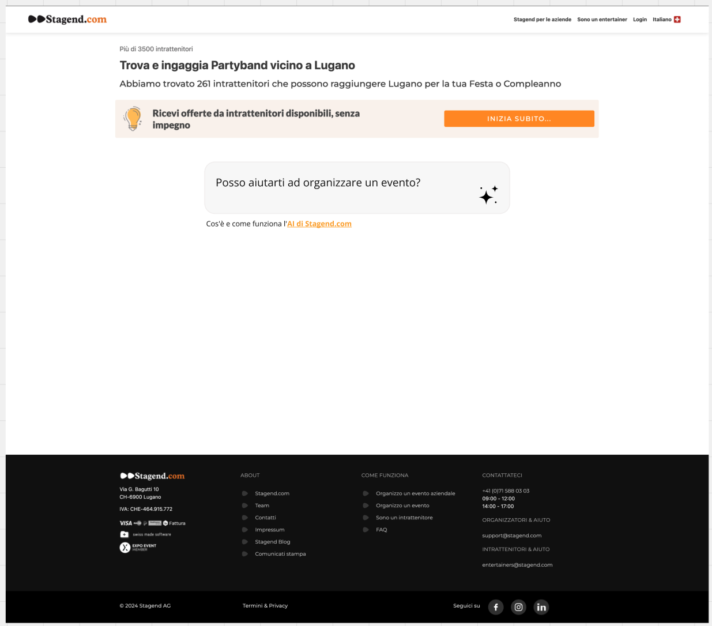
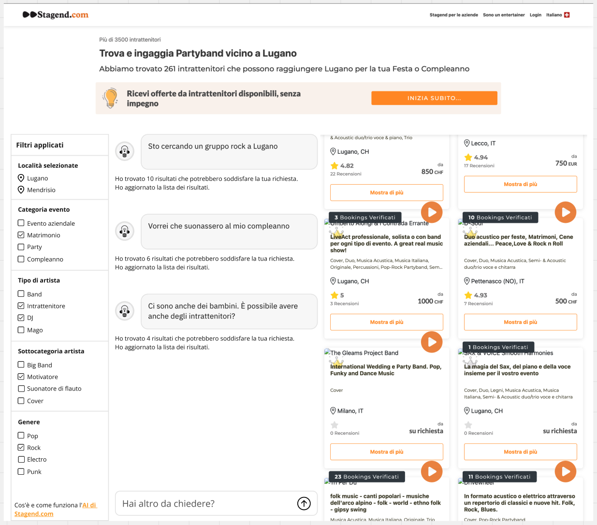

## Developing

Once you've created a project and installed dependencies with `npm install` (or `pnpm install` or `yarn`), start a development server:

```bash
npm run dev

# or start the server and open the app in a new browser tab
npm run dev -- --open
```

Everything inside `src/lib` is part of your library, everything inside `src/routes` can be used as a showcase, demo or preview app.

## Building a library of custom elements (web components)

Here we are using the Svelte's Custom Elements API: `https://svelte.dev/docs/custom-elements-api`.

Build Svelte components defined in `src/lib/web-components` into framework-agnostic custom elements.

### How To
Create Svelte components in `src/lib/components`, then wrap them as web components in the folder `src/lib/web-components`, adding the Svelte `svelte:options customElement` on top of the component source code (see https://svelte.dev/docs/custom-elements-api): 

```html
<svelte:options customElement="PREFIX-counter" />
```

The logic is simple:

as a default rule (for more complex components could be maybe possible to break the rule), keep "store agnostic" the svelte components inside `src/lib/components`:

they can onyl receive `props` from parent, and emit events with svelte's `createEventDispatcher`.

Then wrap the component into an "web component" in `src/lib/web-components`. Here you can link its props and events to the store.

Also, define implementation specific css styles on the wrapped component in `src/lib/web-components`. The original component should be as generic an reusable as possible.

For a simple example see `/Users/jhs/EXMACHINA/ai-search-sveltekit/src/lib/components/AiSearchUserInputForm.svelte` and `src/lib/web-components/wc-ai-search-user-input-form.svelte`.

> **Note:** The "PREFIX-" prefix allows you to define prefixed custom elements. 
> Define it in `vite.webcomponents.config`, setting a value for the variable `LIBRARY_PREFIX`.

Define which components you want to expose, exporting them in the `src/lib/web-components/index.ts` file.

Then run:

```bash
npm run build:webcomponents
```

This command builds the components in `dist-web-components` folder, in `es` e `umd` formats.

Then include the compiled js library in a html page, and use the web components (see `/public/index.html`):

```html
<!DOCTYPE html>
<html lang="en">
<head>
    <meta charset="UTF-8">
    <meta name="viewport" content="width=device-width, initial-scale=1.0">
    <title>Web Components DEMO - mjs</title>
    <style>
        <!-- Your page custom CSS styles go here -->
        <link rel="stylesheet" href="ai.search.web.components.css">
    </style>
</head>
<body>

    <stg-ai-search-core
        api-base-url="http://localhost:8099"
        language="it">
    </stg-ai-search-core>

    <div class="ai-search-container">
        <div class="column left">
            <stg-ai-search-chat></stg-ai-search-chat>
        </div>
        
        <div class="column right">
            <stg-ai-search-results></stg-ai-search-results>
        </div>
    </div>

    <!-- 
    Most modern browsers support ES modules. 
    However, there are still some relatively recent browsers that do not support <script type="module">. 
    Here are a few:
        - Internet Explorer 11 and earlier: Internet Explorer does not support ES modules at all.
        - Microsoft Edge (Legacy): The legacy version of Microsoft Edge (before the switch to Chromium) does not support ES modules.
        - Safari 10.1 and earlier: Safari added support for ES modules in version 11.
        - Firefox 59 and earlier: Firefox added support for ES modules in version 60.
        - Chrome 60 and earlier: Chrome added support for ES modules in version 61.
    -->
    
    <!-- Load ES module scripts - if supported by the web browser -->
    <script type="module" src="ai.search.web.components.es.js"></script>
    
    <!-- Fallback for older browsers - if the browser does not support script type="module" and es files -->
    <script nomodule src="ai.search.web.components.umd.js"></script>
</body>
</html>
```

> Note: the `stg-ai-search-core` component is reuired: it define common styles, stores, and event bus.

## Building a svelte library

To build your library:

```bash
npm run package
```

To create a production version of your showcase app:

```bash
npm run build
```

You can preview the production build with `npm run preview`.

> To deploy your app, you may need to install an [adapter](https://kit.svelte.dev/docs/adapters) for your target environment.

## Web components showcase

The `DEMO` folder is just a showcase of the final product/use (open ìndex.html` file with a web server - for instance `http-server` with Nodejs - to see it).

Run:

```bash
node publish.js
```

after:

```bash
npm run build:webcomponents
```

Or simply run:

```bash
npm run build:webcomponents:publish
```

## Mockup UI

Il folder `MOCKUP_UI` contiene alcune idee su come potrebbe essere sviluppata la UX/UI:






## Technologies

- Svelte to develop and build web components
- Sveltestrap as components library (when and only if required)
- Bootstrap 5 for styles
- CSS modules (https://github.com/css-modules/css-modules/tree/master) for defininig scoped and reusable css rules


# Riepilogo su come usare i vari repo per lo sviluppo

/**
 * Repo: symfony-web-app-docker (stg-dockerized)
 * Docker-compose che tira su sito PHP Stagend, Keycloak, AI Search API e LLM...
 * branch: main
 *
 * Documentazione:
 * - README.md esaustivo su come mettere in piedi tutto l'ambiente usando Docker
 * - folder DOCUMENTAZIONE: con dettagli sull'implmnetazione di AB Variants, Keycloak e AI Search (mock compresi)
 */
git clone git@bitbucket.org:exm-stagend/symfony-web-app-docker.git


/**
 * Repo: stg-service
 * Sito PHP Stagend
 * Branch: exm-ai-search
 *  
 * Documentazione:
 * - documentazione principalmente gestita da stagend. Si veda invece README.md nel repo symfony-web-app-docker
 */
git clone git@bitbucket.org:exm-stagend/stg-service.git


/**
 * Repo: ai-search-web-components
 * Sveltekit project e web components per implementazione ricerca AI
 * branch: sveltestrap
 *
 * Documentazione:
 * - README.md: spiega a linee generali il progetto, come sviluppare e come compilare i web components da usare nel sito Stagend
 * - folder DEMO: contiene una semplice demo dell'uso dei web components generati in una pagina HTML
 * - folder MOCKUP_UI: contiene alcune immagini con un'idea di possible UX/UI
 */
git clone git@bitbucket.org:exm-stagend/ai-search-web-components.git
