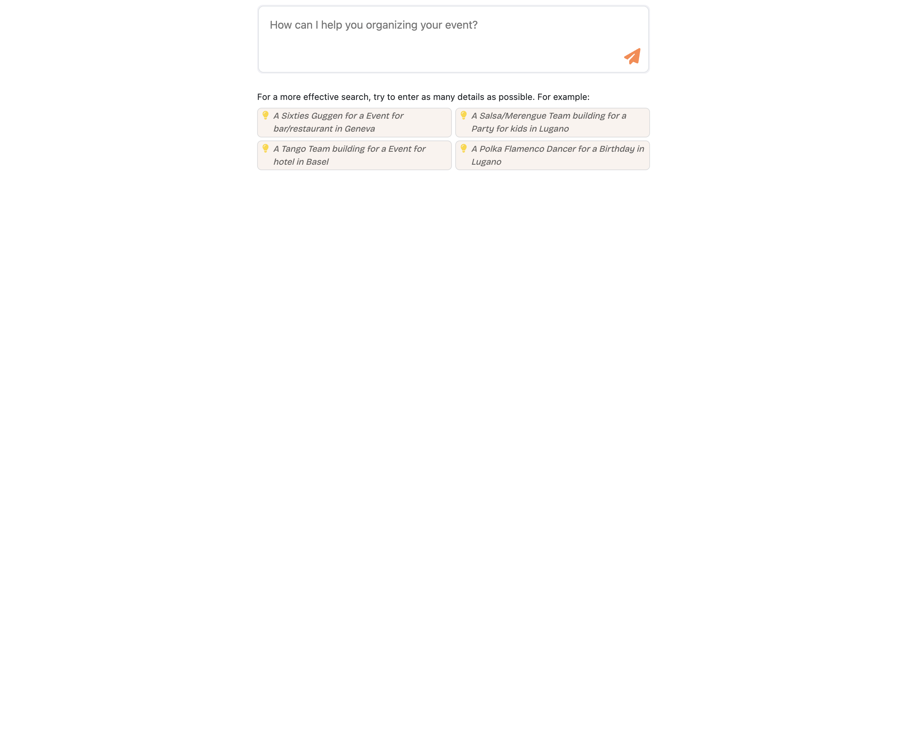
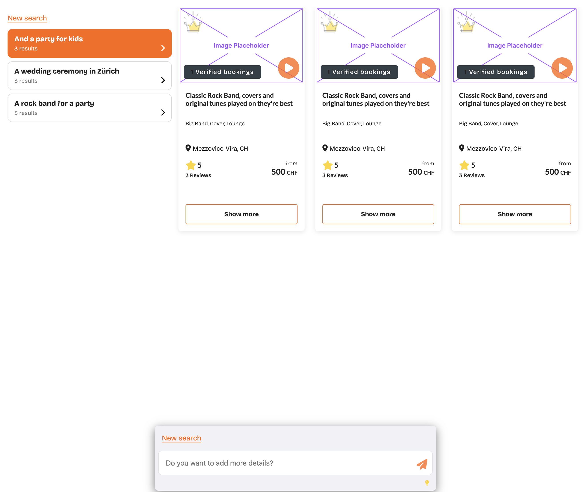
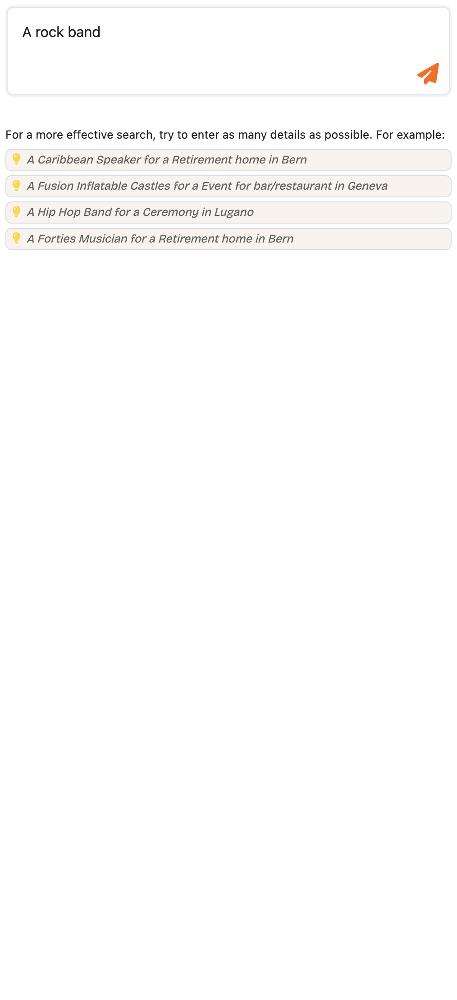

## Developing

Once you've created a project and installed dependencies with `npm install` (or `pnpm install` or `yarn`), start a development server:

```bash
# Install dependencies
npm install

# Develop
npm run dev

# or 
npm run dev -- --open
```

Everything inside `src/lib` is part of the library; everything inside `src/routes` can be used as a showcase, demo or preview app (as well as the folder `DEMO`, which showcase a complete use of web components).

## Building a library of custom elements (web components)

Here we are using the Svelte's Custom Elements API: `https://svelte.dev/docs/custom-elements-api`.

Build Svelte components defined in `src/lib/web-components` into framework-agnostic custom elements.

### How To
Create Svelte components in `src/lib/components`, then "wrap" them as web components in the folder `src/lib/web-components`, adding the Svelte `svelte:options customElement` on top of the component source code (see https://svelte.dev/docs/custom-elements-api): 

```html
<svelte:options customElement="webcomponent-counter" />
```

The main idea is depicted in the following schema:


The logic is simple:

Svelte stores act as a sort of bridge between components. When you build the Svelte components as web components, you can use the single components independently, as, and where, you prefer; nonetheless, they act as a cohesive application, keeping, thanks to the stores, the ability to talk each other, sharing a global state.

As a default rule (for more complex components could be maybe possible to break the rule), keep "store agnostic" the svelte components inside `src/lib/components`: they can onyl receive `props` from parent, and emit events with svelte's `createEventDispatcher`.

Then wrap the component into a "web component" in `src/lib/web-components`. Here you can link its props and events to the store.

Usually, components defined in `src/lib/web-components` are *IMPLEMENTATION SPECIFIC* (for instance, you can also use Boostrap classes or components directly).

Also, define implementation specific css styles on the wrapped component in `src/lib/web-components`. The original component should be as generic an reusable as possible (exceptions being `AiSearchResult` and `AiSearchResultVideoArea`, almost ported 1:1 from the original templates).

For a complete use case, see `src/lib/components/AiSearchPromptArea.svelte` and `src/lib/web-components/wc-ai-search-prompt-area.svelte`.

Configure Vite to build web components in `vite.webcomponents.config`.

> **Note:** The "webcomponent-" prefix allows you to define prefixed custom elements. 
> Configure it in `vite.webcomponents.config`: set a value for `LIBRARY_PREFIX`.

Define which components you want to expose, exporting them in the `src/lib/web-components/index.ts` file.

Then run:

```bash
npm run build:webcomponents
```

This command builds the components in `dist-web-components` folder, in `es` e `umd` formats.

Then include the compiled js library in a html page, and use the web components as you wish (see `DEMO/index.html`, or the complete story in `.storybook-web-components/stories/page.stories.js` for a complete example):

```html
<!DOCTYPE html>
<html lang="en">
<head>
    <meta charset="UTF-8">
    <meta name="viewport" content="width=device-width, initial-scale=1.0">
    <title>Web Components DEMO</title>
    <link rel="stylesheet" href="ai.search.web.components.css">

    <style>
        .site-ai-search {
            display: grid;
            gap: 0.2rem;
            height: 100%;
            width: 100%;
            @media (min-width: 768px) {
                grid-template-columns: 2fr 5fr; 
            }
        }
        .site-ai-search * {
            box-sizing: border-box;
        }
        .site-ai-search__hints {
            display: flex;
            justify-content: center;
            margin-top: 1rem;
        }
        .site-ai-search__hints > stg-ai-search-hints {
            @media (min-width: 768px) {
                max-width: 50vw;
            }
            @media (min-width: 992px) {
                max-width: 30vw;
            }
        }
        .site-ai-search__column {
            display: flex;
            flex-direction: column;
            overflow-y: hidden;
        }
        .site-ai-search__results {
            padding-bottom: 14rem;
        }
        .site-ai-search__queries {
            max-height: 45vh;
            display: none;
            @media (min-width: 768px) {
                display: block; 
            }
        }
        .site-ai-search__queries__new-search-button {
            padding-bottom: 0.5rem;
        }
    </style>
</head>
<body>
    <main>

        <stg-ai-search-app-shell
            base-url="http://ai.search.api.url"
            language="en">
        </stg-ai-search-app-shell>

        <stg-ai-search-prompt-area></stg-ai-search-prompt-area>

        <div class="site-ai-search__hints">
            <stg-ai-search-hints></stg-ai-search-hints>
        </div>
    
        <div class="container">
            <div class="row">
                <div class="col-12">

                    <stg-ai-search-error-notification></stg-ai-search-error-notification>
    
                    <div class="site-ai-search">
                        <div class="site-ai-search__column site-ai-search__column--left">
                            <div class="site-ai-search__queries">
                                <div class="site-ai-search__queries__new-search-button">
                                    <stg-ai-search-new-search-button></stg-ai-search-new-search-button>
                                </div>
                                <stg-ai-search-queries></stg-ai-search-queries>
                            </div>
                        </div>
                        
                        <div class="site-ai-search__column site-ai-search__results">
                            <stg-ai-search-results></stg-ai-search-results>
                        </div>
                    </div>
    
                </div>
            </div>
        </div>
    </main>

    <script type="module" src="ai.search.web.components.es.min.js"></script>
    <script nomodule src="ai.search.web.components.umd.min.js"></script>
</body>
</html>
```

> Note: the `stg-ai-search-app-shell` component is required: it works as a trait d'union between web components, defining common styles, and the stores/event bus.

## Web components showcase

The `DEMO` folder is just a showcase of the final product/use (run the `index.html` file on a web server - for instance `http-server` - to see it).

To build and "publish" web components in the demo folder (but also to copy them in the final product), run:

```bash
# You can configure this script in order to copy files where you prefer
node publish.js
```

after:

```bash
npm run build:webcomponents
```

Or simply run the following command to build and copy your files:

```bash
npm run build:webcomponents:publish
```

## Mockup UI

The `MOCKUP_UI` folder contains a few UX/UI screenshots (desktop and responsive):

<table>
    <tr><td></td></tr>
    <tr><td></td></tr>
    <tr><td></td></tr>
    <tr><td></td></tr>
    <tr><td></td></tr>
    <tr><td></td></tr>
    <tr><td></td></tr>
    <tr><td>/td></tr>
</table>

## Technologies

- Svelte/Vite to develop and build/deploy web components
- Sveltestrap as components library (only if and when required)
- Bootstrap 5 for styles (only if and when required)
- CSS modules (https://github.com/css-modules/css-modules/tree/master) for defininig scoped and reusable css rules
- svelte-i18n library for localization:
  - Library: https://github.com/kaisermann/svelte-i18n
  - Tips: https://centus.com/blog/svelte-localization#:~:text=svelte%2Di18n%20will%20automatically%20choose,value%20and%20the%20current%20locale
- Storybook to showcase components
- Font-awesome icons through the "svelte-fa" package 
  - Library: https://cweili.github.io/svelte-fa/
  - Icons packages: https://www.npmjs.com/search?q=%40fortawesome%20svg%20icons
  - Font-awesome catalog: https://fontawesome.com/v6/search?o=r&m=free&s=solid

    ```js
    import Fa from 'svelte-fa';
    import { faUser } from '@fortawesome/free-regular-svg-icons';

    <Fa icon={faUser} />
    ```

## Storybook

Launch storybook with:

```bash
# Launch storybook for svelte components on port 6006
npm run storybook:svelte

# Launch storybook for web components on port 6007
npm run storybook:webcomponents

# Launch a storybook composition of storybook:svelte and storybook:webcomponents on port 6007
npm run storybook
```

### References for storybook/svelte/web components

https://github.com/LWC-Essentials/storybook/blob/master/packages/lwc-library/stories/hello-time.stories.js

https://github.com/storybookjs/addon-svelte-csf/tree/main

https://github.com/21RISK/svelte-storybook-events